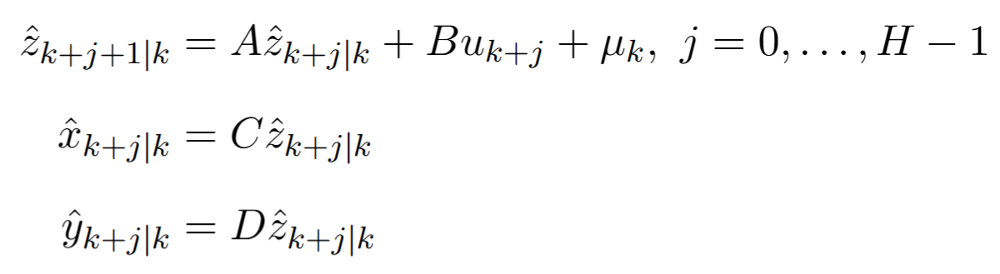
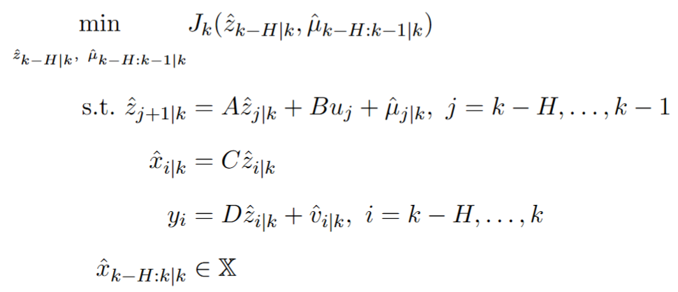
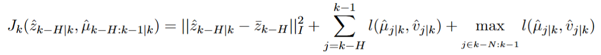
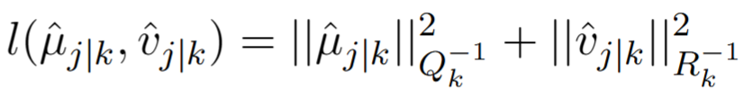
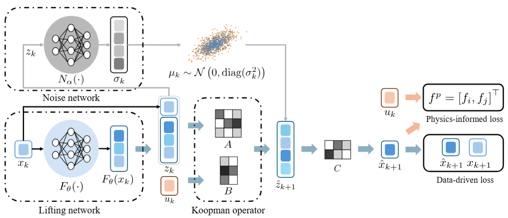

README
===========================

This repo includes the source code of paper [**Self-tuning moving horizon estimation of nonlinear systems via physics-informed machine learning Koopman modeling**](https://aiche.onlinelibrary.wiley.com/doi/abs/10.1002/aic.18649 "Go to the paper page on AIChE Journal").

## Component

* [Physics-informed stochastic Koopman modeling](#physics-informed-stochastic-koopman-modeling)
* [Moving horizon estimation](#moving-horizon-estimation)

### Physics-informed stochastic Koopman modeling

A stochastic Koopman model is formulated as follows:

### Moving horizon estimation

A moving horizon estimation with automatic generated weighting matrices is designed. The optimization problem is in the following form:

with the objective function to be   

and the stage cost

## Model structure

